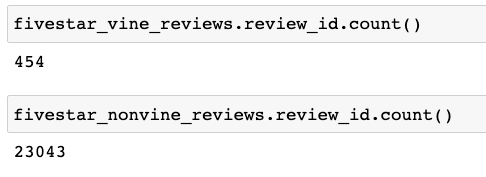
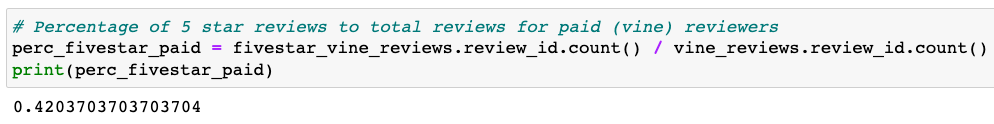
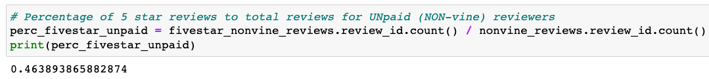

# Amazon_Vine_Analysis
Using PySpark to perform the ETL process to extract a dataset, transform the data, connect to an AWS RDS instance, and load the transformed data into pgAdmin

## Overview
 The purpose of this project was to investigate the potential for bias in amazon product reviews.  Amazon has a  special program, Vine, that is a service that allows manufacturers and publishers to receive product reviews from Vine program members who are provided products and payments in exchange for those reviews. This analysis sought to determine if products reviewed by Vine members were disproportionately higher rated than reviews by non vine members. 

## Resources
  * Python
  * Pandas
  * Postgres
  * pgAdmin
  * AWS Relational Database System
  * Amazon Product Review data

# Results
The following analyses were performed to evaluate the potential for bias in reviews completed by vine members. A file of 3,093,869 reviews were drawn from publicly available datasets from Amazon. This study focused on the ‘US Electronics’ subcategory.  The data was then narrowed to items that had at least 20 reviews and at least 50 % helpful votes. Next, the vine reviews (1080) were parsed and counted from the non-vine reviews (49,673). Then the data was filtered for five star reviews and counted for both groups. 

Figure 1. Five Star Reviews

Figure 2. Percentage of Paid Reviews

Figure 3. Percentage of Unpaid Reviews

As can be seen from the output, the percentage of five star paid reviews (42%) was very similar to the percentage of unpaid reviews (46%). This suggests that the paid nature of the vine review program is not influencing reviewers in a way that results in higher scores for products. 
